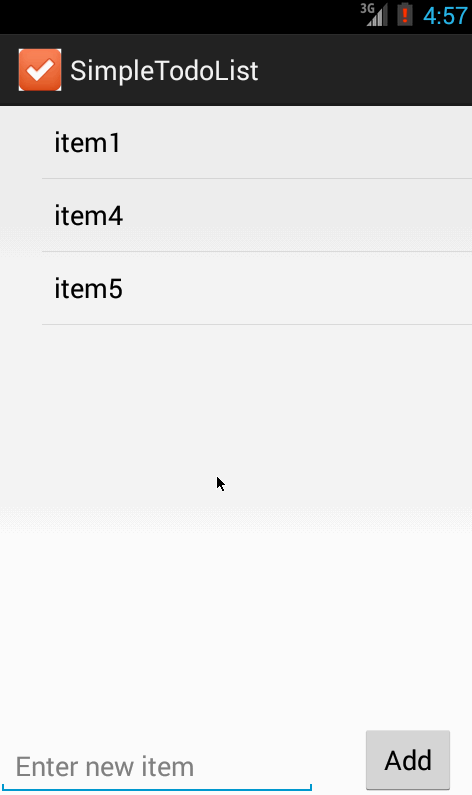

simpletodolist
==============
Audience: CodePath Android Bootcamp evaluation

Simple todo list which allows addition, removal and editing of text items. The values are persisted on the local storage.

Completed items:
  1. add item
  1. delete item with long click
  1. edit item via a new activity and passing data using intents
  1. data persistence to local storage

Screencast:

