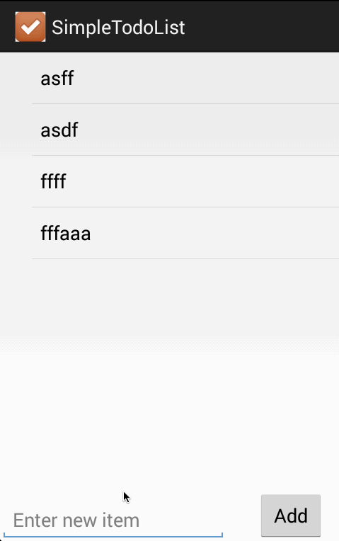

simpletodolist
==============
Audience: CodePath Android Bootcamp evaluation

Simple todo list which allows addition, removal and editing of text items. The values are persisted on the local storage.

Completed items:
  1. add item
  1. delete item with long click
  1. edit item via a new activity and passing data using intents
  1. data persistence to local storage
  2. confirmation on delete (new in 1.1)
  3. take a photo and link it to an item (new in 1.1)
  4. attach an existing photo to an item (experimental; new in 1.1)
  5. record and link an audio file to an item (new in 1.1)
  6. using Toast popups to make app more chatty and user friendly (new in 1.1)

Screencast:

